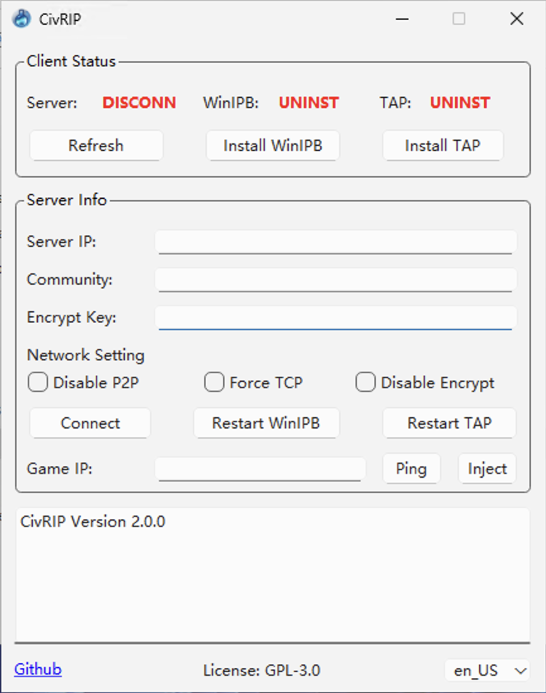

# civrip
**100% open source**

GUI to create virtual network for civilization 6 and old school games in multiplayer mode.

简单GUI为文明6及老游戏联机提供虚拟组网。

[中文Readme](README_zh_CN.md)



## Motivation
Civilization 6 and other old school games only support LAN for multiplayer (if you cannot connect to Civilization 6 official server). The most common way is to create a virtual network to simulate a LAN.

Possible solution:
- [Zerotier](https://www.zerotier.com/): Work for most cases. However, when user is behind firewall that does not allow P2P hole punching, the experience is very annoying. Self-hosting moon node is another solution, but UDP QoS is a new challenge for some ISPs. 
- [n2n](https://github.com/ntop/n2n): Similar to Zerotier, but it needs a coordinator server to connect different users and forwarding traffic (if P2P is disabled). It allows the user to force TCP connection instead of UDP.
- VPN: Also work for most cases, but it is too heavy and not allowed in some network environment.

~~Civilization 6 has another problem that it only scan the default NIC for local rooms, but most solutions based on virtual NIC. We need [WinIPBroadcast](https://github.com/dechamps/WinIPBroadcast) to send IP broadcast packets to all interfaces.~~

Update: Inspired by @xaxys (https://github.com/xaxys/injciv6/tree/master), we now have a newer solution through function hook. 

I developed this tool to automate the process for Civilization 6 multiplayer mode (and old school games), based on n2n to overcome network issues.

## Server Deploy
In order to provide better experience, you need to have a VPS or public IP address. Please deploy n2n 3.0 on the server, or use our docker image.

```
vim docker-compose.yml
# modify the port

vim community.list
# add community

docker compose up -d
```

Community acts like the channel on the server, and provide basic authentication. You MUST provide a community list to use civrip.

Example `community.list`
```
civsix
free
```
The server will have two community, `civsix` and `free`.

## Client
Download the latest release on the [release page](https://github.com/MXWXZ/civrip/releases).

### v2.0

1. Execute `civrip.exe`
2. Click `Install TAP` if status is `UNINST`.
3. Click `Restart TAP` if status is `STOPPED` or `UNKNOWN`.
4. Fill in `Server IP` with port, e.g., `1.2.3.4:7654`.
5. Fill in `Community` configured by server, e.g., `civsix`.
6. Fill in `Encrypt Key`, this can be arbitrary, e.g., `114514`.
7. Do not check any network setting and click `Connect`.

If you are game server: 
1. Make sure server status is `CONNECT`.
2. Find the LAN IP in the output (e.g., 10.0.0.100).
3. Disable the firewall, create the game room and tell your IP to the others!

If you are joining others server:
1. Make sure server status is `CONNECT`.
2. Fill in `Game IP` with the LAN IP of the game server.
3. Click `Ping` to make sure you can touch the server.
4. Start the game. Click `Inject` when you are at the game menu.

### v1.0

1. Execute `civrip.exe`
2. Click `Install WinIPB` or `Install TAP` if status is `UNINST`.
3. Click `Restart WinIPB` or `Restart TAP` if status is `STOPPED` or `UNKNOWN`.
4. Fill in `Server IP` with port, e.g., `1.2.3.4:7654`.
5. Fill in `Community` configured by server, e.g., `civsix`.
6. Fill in `Encrypt Key`, this can be arbitrary, e.g., `114514`.
7. Do not check any network setting and click `Connect`.
8. If server status is `CONNECT`, go and play your game! Otherwise, please check the output by yourself.

## Troubleshooting

### v2.0 FAQ

> I am the game server, but I cannot find the LAN IP.

Please check EDGE connection below.

> I am joining others game, but I cannot ping the server.

Please make sure you have the LAN IP, check EDGE connection below and disable the firewall on the game server.

> I see errors after clicking the `Inject`.

Please start the game first and wait for the main menu. There will be two logs about `Injector` (for DX11 and DX12). It is expected to have one error log and one success log. It is OK when any of them reports success.

> I want to change the Game IP. Do I need to restart the game?

No. Click eject, modify the Game IP and inject again is OK.

> I am using 32-bit system. How to run?

Unfortunately, we do not support 32 bit officially. You can compile the project by yourself (see below).

### EDGE connection

These only work if your server status is `CONNECT`, otherwise please solve the server connection problem first.

If you cannot find the room or cannot connect to the room, please follow the steps below. Please check the game to see if you solve the problem after complete each step:

1. Disconnect, uncheck all network settings and connect again.
2. Disconnect, click `Restart WinIPB` and `Restart TAP`, then connect again.
3. Disconnect, check `Disable P2P` and connect again (This will disable P2P to bypass strict NAT network, you need to pay for the bandwidth for your VPS!).
4. Disconnect, check `Disable P2P` and `Force TCP` and connect again (This may solve some UDP QoS problem).
5. Disconnect, check `Disable P2P`, `Force TCP` and `Disable Encrypt` and connect again.
6. Change another network and start from step 1.
7. Restart the computer and start from step 1.
8. Reinstall your Windows system.
9. Buy another computer.

If you can connect, but the connection is not stable, please check `Disable P2P` (and `Force TCP` if possible).

## Compile

It is possible that the injector and the main program are marked as virus by anti-virus softwares. This software and third-party dependencies are 100% open-source. You can compile the program by yourself.

Environment:
- QT6
- Visual Studio (C++ Desktop support is the minimum)

Compile:
1. `cd detours/src` and run `nmake` (Please use VS x64 compile chains).
2. Open `hook/hook.sln` and compile for `x64 | Release`.
3. Open `civrip.pro` and compile for `Release`.

Third party:
- WinIPBroadcast: https://github.com/dechamps/WinIPBroadcast
- Tap Windows: https://community.openvpn.net/openvpn/wiki/GettingTapWindows
- n2n: http://github.com/ntop/n2n
- Injector: https://github.com/nefarius/Injector

## License
GNU General Public License v3.0