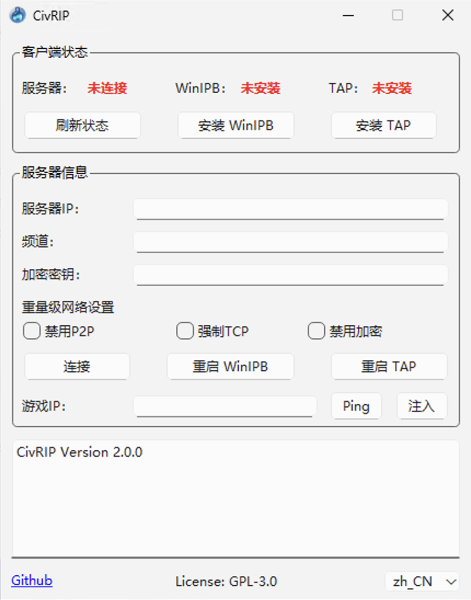

# civrip
**100%开源**

简单GUI为文明6及老游戏联机提供虚拟组网。

**本软件完全免费且开源，严禁任何形式的倒卖、二次封装售卖。**

**软件基于GPL3.0协议，二次修改前请遵循协议要求。**




## 为什么有这个项目？
文明6以及其他老游戏只支持局域网多人游戏（文明6官方服务器国内什么情况懂得都懂），常见的解决方法是创建一个虚拟局域网。

一些解决方案：
- [Zerotier](https://www.zerotier.com/)：多数情况下够用，但是一些重量级的网络（例如各种校园网和长城宽带等）不支持P2P打洞，用户体验会很差。当然自建moon节点是一个解决方法，不过碰到运营商UDP QoS就很难搞了。
- [n2n](https://github.com/ntop/n2n): 类似Zerotier，不过需要自建一个协调服务器，当P2P不可用时中转流量。优点是可以指定加密类型和协议，对于国内网络环境比较友好。
- VPN: 也是一种解决方法，不过对于臭打游戏的而言算是杀鸡用牛刀了，效果也不一定好。

~~文明6更是重量级，由于只搜索默认网卡的网段，但大部分上述方案都使用了虚拟网卡，因此还需要 [WinIPBroadcast](https://github.com/dechamps/WinIPBroadcast) 将数据包转发到所有网卡才能搜到房间。~~

更新：感谢 @xaxys (https://github.com/xaxys/injciv6/tree/master) 提供的思路，现在可以采用hook函数的方式解决。

由于配置上述方案对于玩家而言太过复杂，群友的网络环境千奇百怪，因此我写了这个基于n2n的小工具来自动化大部分流程，基本上是基于文明6联机而优化的，其他老游戏应该也能使用。

## 服务端部署
为了保证用户体验，你需要有一个VPS或者有公网IP的电脑。请在服务器上部署n2n 3.0，或者使用我预编译好的docker镜像。

```
vim docker-compose.yml
# 修改端口

vim community.list
# 添加 community

docker compose up -d
```

Community类似于服务器上的频道，同时提供一个简易的身份认证功能，用户连接的community必须是服务器所定义的，防止被其他人使用。你在这里必须设定一个community列表。

`community.list` 样例
```
civsix
free
```
服务器会有两个频道，`civsix` 和 `free`。

## 客户端
在[release page](https://github.com/MXWXZ/civrip/releases)下载最新客户端。


### v2.0

1. 双击打开 `civrip.exe`
2. 如果客户端状态是 `未安装`，请点击 `安装 TAP`。
3. 如果客户端状态是 `已停止` 或 `未知`，请点击 `重启 TAP`。
4. 填写 `服务器 IP`，包括端口号。例如 `1.2.3.4:7654`。
5. 填写 `频道`，需要是服务器所定义的。例如 `civsix`。
6. 填写 `加密密钥`，可任意填写。例如 `114514`。
7. 不要选中任何重量级网络设置，点击 `连接`。

如果你是房主：
1. 确保服务器状态是 `已连接`。
2. 在日志里找到内网IP（例如 10.0.0.100）。
3. 关闭防火墙，创建游戏房间并将IP告知其他人！

如果你要加入其他人的游戏：
1. 确保服务器状态是 `已连接`。
2. 在 `游戏IP` 中填写房主的内网IP。
3. 点击 `Ping` 检测连接情况。
4. 启动游戏，在主菜单界面点击 `注入`。

### v1.0

1. 双击打开 `civrip.exe`
2. 如果客户端状态是 `未安装`，请点击 `安装 WinIPB` 或者 `安装 TAP`。
3. 如果客户端状态是 `已停止` 或 `未知`，请点击 `重启 WinIPB` 或者 `重启 TAP`。
4. 填写 `服务器 IP`，包括端口号。例如 `1.2.3.4:7654`。
5. 填写 `频道`，需要是服务器所定义的。例如 `civsix`。
6. 填写 `加密密钥`，可任意填写。例如 `114514`。
7. 不要选中任何重量级网络设置，点击 `连接`。
8. 如果服务器状态是 `已连接`，打开游戏开玩！否则你需要根据日志输出自行解决连接问题。

## 疑难杂症

### v2.0 FAQ

> 我是房主，但在日志里找不到内网IP。

请参见下方协调服务器连接问题。

> 我要加入其他人的游戏，但我Ping不通房主。

请先确保自己获取了内网IP，并参考下方解决协调服务器连接问题，最后让房主确保关闭防火墙。

> 我点击 `注入` 后有报错。

请先启动游戏，等待主菜单出现后注入。日志中会有两个 `Injector` 相关日志（分别对应DX11和DX12）。其中一个日志报错一个日志成功是正常现象，确保任意一个日志成功即可。

> 我要修改游戏IP，需要重启游戏么？

不需要，点击弹出，修改IP，重新注入即可。

> 我是32位系统，如何运行？

很不幸，目前我们并不对32位系统提供技术支持。你可以自行编译程序，理论上没有问题（见下方）。

### 协调服务器连接问题
请注意，下面的方法仅限于服务器状态是 `已连接`，但是搜不到房间或进不去房间，如果你连服务器都无法连接则需要根据日志自行解决（通常是服务器配置问题，例如防火墙阻断）。

如果搜不到房或者无法连接进房，请尝试下面的步骤。注意请每做一步试一下问题是否解决，能否进入游戏：

1. 断开连接，取消选中任何重量级网络设置，再次连接。
2. 断开连接，点击 `重启 WinIPB` 和 `重启 TAP`，再次连接。
3. 断开连接，勾选 `禁用 P2P`，再次连接（这将强制禁用P2P，从而绕过严格NAT模式网络，但请注意可能产生VPS流量费用）。
4. 断开连接，勾选 `禁用 P2P` 和 `强制 TCP`，再次连接（这可能解决一些UDP QoS的问题）。
5. 断开连接，勾选 `禁用 P2P`，`强制 TCP` 和 `禁用加密`，再次连接。
6. 换一个网络，从步骤1再次尝试。
7. 重启电脑，从步骤1再次尝试.
8. 重装系统。
9. 重买电脑。

如果可以连接，但是连接不稳定或很卡，请勾选 `禁用 P2P`（还是卡请同时勾选 `强制 TCP`）。

## 编译

由于程序存在线程注入高危操作，可能会被杀毒软件报毒。本程序及所有第三方软件均为100%开源，你可以自行编译程序。

环境：
- QT6
- Visual Studio (至少需要C++ Desktop组件)

编译
1. `cd detours/src`，运行 `nmake` （请使用 VS x64 编译工具链）。
2. 打开 `hook/hook.sln` 并编译 `x64 | Release`。
3. 打开 `civrip.pro` 并编译 `Release`。

第三方软件：
- WinIPBroadcast: https://github.com/dechamps/WinIPBroadcast
- Tap Windows: https://community.openvpn.net/openvpn/wiki/GettingTapWindows
- n2n: http://github.com/ntop/n2n
- Injector: https://github.com/nefarius/Injector

## License
GNU General Public License v3.0